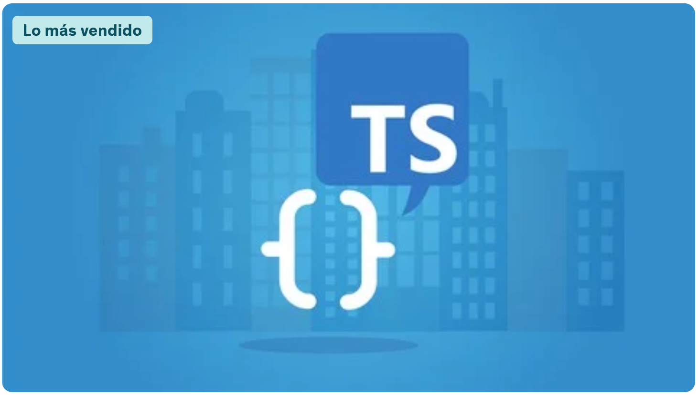

# [Understanding TypeScript by Maximilian Schwarzmüller](https://www.udemy.com/course/understanding-typescript/)
## Boost your JavaScript projects with TypeScript: Learn all about core types, generics, TypeScript + React or Node &amp; more!

### What you will Learn...

#### 1) Use TypeScript and its Features like Types, ES6 Support, Classes, Modules, Interfaces and much more in any of their Projects
#### 2) Understand what TypeScript really, it’s all about and how it works
#### 3) Why TypeScript offers a real advantage over vanilla JavaScript
#### 4) Learn about basic and advanced features (e.g., "infer", "as const", "satisfies" & much more!)
#### 5) Explore Classes, Interfaces, Generic Types, Derived Types & Other Crucial Concepts
#### 6) Learn TypeScript both in theory as well as applied to real use-cases and projects
#### 7) Learn how to combine TypeScript with ReactJS, NodeJS & ExpressJS
